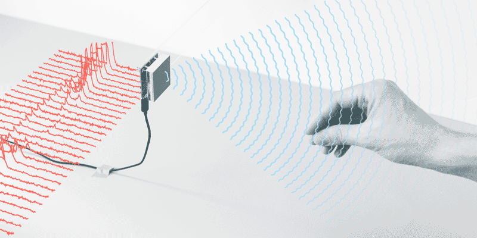
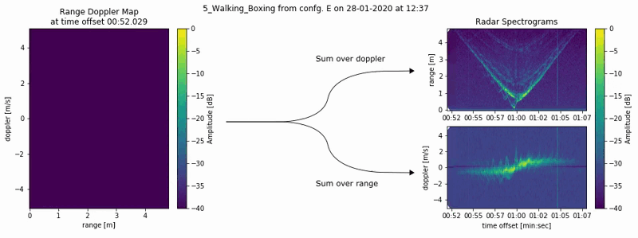
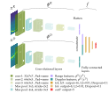

# Unsupervised Domain Adaptation across FMCW Radar Configurations Using Margin Disparity Discrepancy

The content of this page serves as supplementary material to the presentation of our work at [EUSIPCO2022](https://2022.eusipco.org/) in Belgrade. A [preprint][preprint] is also available.

[preprint]: https://arxiv.org/abs/2203.04588

## Radar ML

Radar sensing has gained research interst over the past few years due to several
factors. On the one hand, semiconductor companies have managed to produce highly
integrated radar chipsets thanks to the
[Frequency-modulated continuous
wave (FMCW)](https://www.infineon.com/dgdl/Infineon-Radar%20FAQ-PI-v02_00-EN.pdf?fileId=5546d46266f85d6301671c76d2a00614) technology. An example of this is the
[60 GHz sensor frontend](https://www.infineon.com/cms/en/product/promopages/60GHz/)
developed by Infineon that lies at the core of Google's [Soli Project](https://atap.google.com/soli/).

On the other hand, radar sensors enable interesting
[IoT applications](https://www.infineon.com/cms/en/product/sensor/radar-sensors/radar-sensors-for-iot/), such as human activity and surveillance or hand gesture
recognition, and it presents some advantages to cameras when
it comes to privacy concerns and ill-posed optical scenarios, including
through-wall and bad-lighting situations.

### Signal preprocessing

Range and speed (also known as Doppler shift) of FMCW radar targets can
be explored through so-called Range-Doppler maps, which convey information
from the radar targets over both dimensions.

Since a series of Range Doppler maps is 3-dimensional and thus requires large neural networks to work with,
we extract so-called range and Doppler spectrograms by summing over
the corresponding axis. This allows us to train a light neural network that takes both range and
Doppler dynamic signatures and extracts the most relevant features from
them through two separate branches convolutional layers.

## Domain adaptation

The complexity of the classification of radar signatures has driven radar approaches to
resort to machine learning and deep learning techniques that require
high amounts of data. This poses a challenge to radar, especially
when aspects such as the sensor's configuration, the environment or user
settings have a large diversity. Each of these aspects may indeed lead to changes in the data domain in the sense of **domain adaptation theory**.

Domain adaptation techniques consider the case where the underlying probability distribution of data differs
between a **source domain**, from which we can draw sufficient training
data, and a **target domain** that we ultimately aim for deployment.

Such a framework allows an easier deployment from pre-trained models,
where only few labeled data from the target domain is required for fine-tuning.
This is known as **supervised domain adaptation** and we
already investigated for radar in **[3]**. For this paper, we have
moved on to the more demanding situation where the target data is
provided without labels from the label space, also called **unsupervised
domain adaptation**.

### Margin Disparity Discrepancy 

The unsupervised domain adaptation
method we have used is called Margin Disparity Discrepancy (MDD) and it has been recently
developed by Zhang et al. **[1]** based on theoretical guarantees and tested on
computer vision datasets. The authors have proved that the true error in the
target domain can be bounded by the empirical error in the source domain
plus a residual ideal loss and the so-called MDD term.

As a small theoretical contribution to MDD, we have managed to upper
bound the empirical source error from the original, which originally
uses the ramp loss, by its cross-entropy counterpart.
This is important since the ramp loss is non-convex und thus unpractical for ML training.
In fact, the authors of **[1]** perform their experiments with the cross-entropy loss.

The whole proof for the cross-entropy bound is in [our paper][preprint]. As a visual intuition,
though, one can just regard the cross-entropy as a smooth
version of hinge loss, which in turn is nothing more
than a convex relaxation of the ramp loss.

## References

1.  Zhang, Y., Liu, T., Long, M. and Jordan, M. (2019) ‘Bridging Theory and Algorithm for Domain Adaptation’, in _International Conference on Machine Learning_. _International Conference on Machine Learning_, PMLR, pp. 7404–7413. Available at: http://proceedings.mlr.press/v97/zhang19i.html.
2.  Liang, X., Wang, X., Lei, Z., Liao, S. and Li, S.Z. (2017) ‘Soft-Margin Softmax for Deep Classification’, in D. Liu, S. Xie, Y. Li, D. Zhao, and E.-S.M. El-Alfy (eds) _Neural Information Processing_. Cham: Springer International Publishing (Lecture Notes in Computer Science), pp. 413–421. Available at: https://doi.org/10.1007/978-3-319-70096-0_43.
3.  Khodabakhshandeh, H., Visentin, T., Hernangómez, R. and Pütz, M. (2021) ‘Domain Adaptation Across Configurations of FMCW Radar for Deep Learning Based Human Activity Classification’, in _2021 21st International Radar Symposium (IRS)_. _2021 21st International Radar Symposium (IRS)_, Berlin, Germany, pp. 1–10. Available at: https://doi.org/10.23919/IRS51887.2021.9466179.
4.  Hernangómez, R., Bjelakovic, I., Servadei, L. and Stańczak, S. (2022) ‘Unsupervised Domain Adaptation across FMCW Radar Configurations Using Margin Disparity Discrepancy’, in _2022 30th European Signal Processing Conference (EUSIPCO)_. Belgrade, Serbia. Available at: http://arxiv.org/abs/2203.04588.
5.  Hernangómez, R., Santra, A. and Stańczak, S. (2019) ‘Human Activity Classification with Frequency Modulated Continuous Wave Radar Using Deep Convolutional Neural Networks’, in _2019 International Radar Conference (RADAR)_. _2019 International Radar Conference (RADAR)_, Toulon, France: IEEE, pp. 1–6. Available at: https://doi.org/10.1109/RADAR41533.2019.171243.
6.  Hernangómez, R., Santra, A. and Stańczak, S. (2021) ‘Study on feature processing schemes for deep-learning-based human activity classification using frequency-modulated continuous-wave radar’, _IET Radar, Sonar & Navigation_, 15(8), pp. 932–944. Available at: https://doi.org/10.1049/rsn2.12066.
7.  Lien, J., Gillian, N., Karagozler, M.E., Amihood, P., Schwesig, C., Olson, E., Raja, H. and Poupyrev, I. (2016) ‘Soli: ubiquitous gesture sensing with millimeter wave radar’, _ACM Transactions on Graphics_, 35(4), p. 142:1-142:19. Available at: https://doi.org/10.1145/2897824.2925953.
8.  Motiian, S., Jones, Q., Iranmanesh, S. and Doretto, G. (2017) ‘Few-Shot Adversarial Domain Adaptation’, _Advances in Neural Information Processing Systems_, 30\. Available at: https://proceedings.neurips.cc/paper/2017/hash/21c5bba1dd6aed9ab48c2b34c1a0adde-Abstract.html.
9.  Santra, A. and Hazra, S. (2020) _Deep learning applications of short-range radars_. Artech House.
